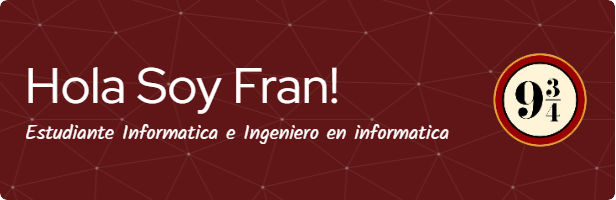

# Hola, Soy Fran! 🔵⚪🔵

## Sobre Mí 💻

#### Soy desarrollador Frontend y Backend. Me gusta mas el apartado Backend y la Administracion con Bases de datos. Me gusta aprender y objectivo de desarrollo inovadores y productivos. 

 - Estoy aprendiendo
    - .Net
    - Redes
    - MySql
 - Me encanta ayudar 🔑, jugar videojuegos 💻, Viajar ✈, Tocar y escuchar musica 🎼, ... y comer 🍔😛  

## Tecnologia de desarrollo

## Otras aplicaciones 🎇

## Github

 

